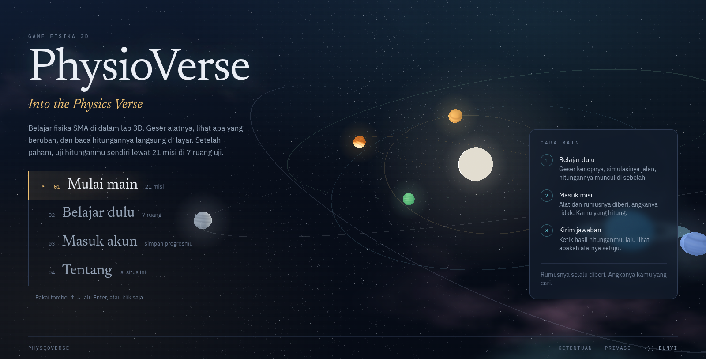
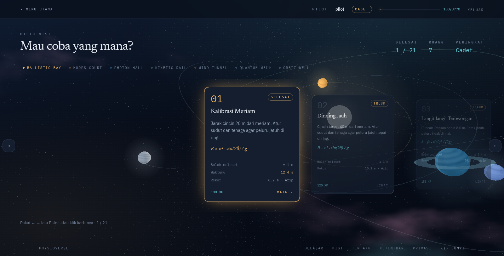
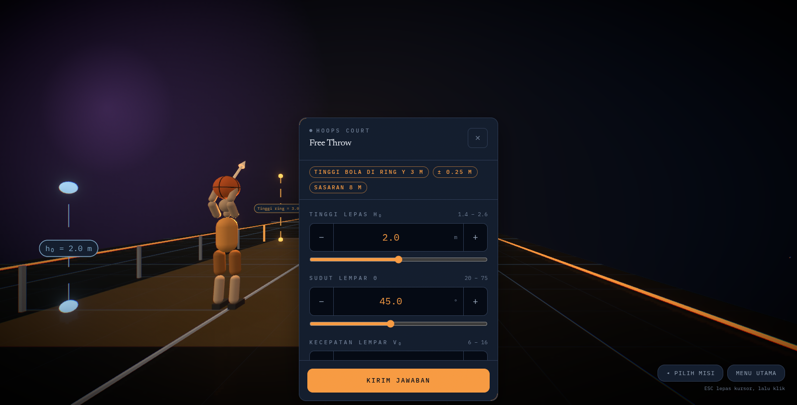
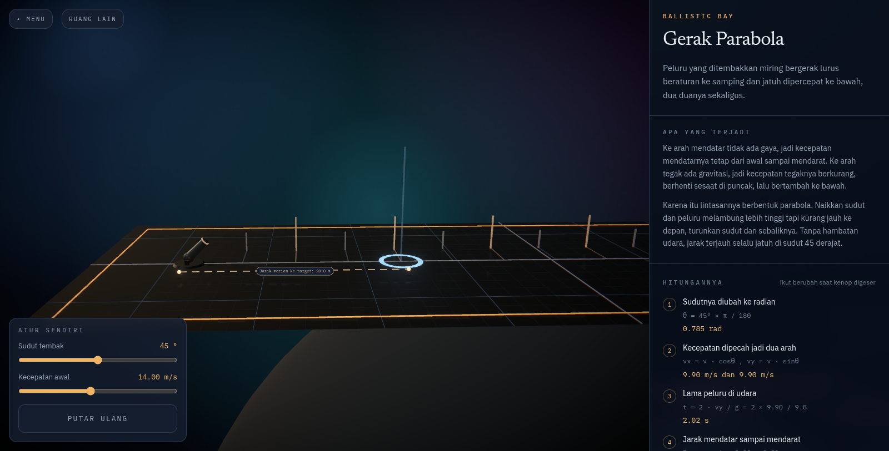
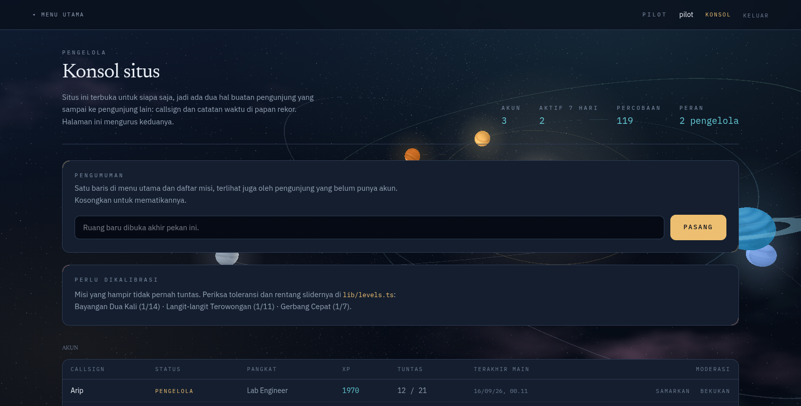
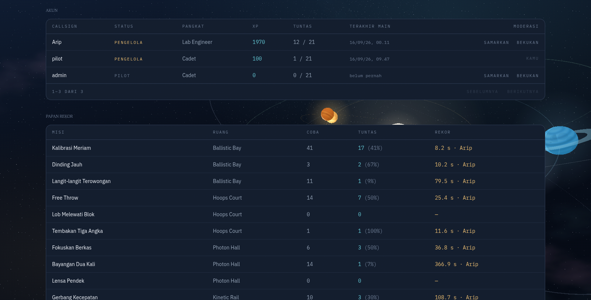

# PhysioVerse: Into the Physics Verse

A first-person physics game for high school students. You walk into a test
facility, read the brief, work the numbers out yourself, dial them into the
console, and watch the room prove you right or wrong.

Next.js 16 (App Router), Tailwind v4, Supabase, React Three Fiber.
Licensed under the [MIT License](LICENSE).

## What it looks like

|  |  |
| --- | --- |
|  |  |
| **Main menu.** Everything opens from here, no account required. | **Mission list.** 21 missions across 7 chambers, with your best time next to the standing record. |
|  |  |
| **Inside a chamber.** Walk to the bench, press `E`, and the console opens where you stand. | **Learning mode.** Drag a knob, the simulation reruns, and the working is written out line by line beside it. |
|  |  |
| **Operator console.** The site notice, and the missions almost nobody solves. | **Moderation.** Freeze an account or mask a callsign, 25 rows to a page. |

## Sub-theme: Education

Physics at high school is taught as formulas on a whiteboard. Students memorise
`R = v² sin(2θ) / g` without ever seeing what the formula does when you change a
number in it, so the symbols stay abstract and the intuition never arrives.

PhysioVerse attacks that gap from two directions.

* **Learning mode** gives the formula a body. Drag the launch angle and the
  trajectory redraws while the arithmetic rewrites itself line by line using the
  number you just picked. The question "why is 45 degrees always the farthest"
  gets answered by moving a slider, not by reading a paragraph.
* **Mission mode** turns it around. The instruments and the formula are given,
  the numbers are not. You calculate, you commit to an answer, and the room runs
  the experiment to see whether the world agrees with you.

The topics follow the SMA syllabus: projectile motion, uniformly accelerated
motion, thin lenses, air resistance, double-slit interference, and orbits. Every
mission is scored by simulating what you asked for rather than by matching a
stored answer key, which is why the same engine can host a mission and a lesson
without either one being a quiz.

## Two roles

The site is open to the public, so anyone can sign up. That leaves exactly two
pieces of visitor-authored content reaching other visitors: **callsigns** and
**leaderboard times**. The second role exists to look after both.

| Role | How to get in | What it can do |
| --- | --- | --- |
| **Pilot** (`player`, the default for every new account) | `/auth/login` | Learning mode, 21 missions, recorded attempts, leaderboard, rank and XP |
| **Operator** (`admin`) | same login, a **KONSOL** link appears in the top bar | Everything above, plus `/admin` |

What an operator can do on `/admin`:

* Post a one-line notice to the main menu and the mission list, visible to
  logged-out visitors too. Clear the field to take it down.
* Freeze or restore an account. A frozen account cannot open missions and drops
  off the leaderboard, but nothing is deleted, so the decision is reversible.
* Mask an abusive or impersonating callsign. The name is replaced, the account
  and its XP stay intact.
* Delete a suspect time from the leaderboard.
* Read the health of the site: account count, who played in the last 7 days, and
  any mission solved by fewer than one player in five, which usually means the
  tolerance or the slider range is wrong rather than the players.

The split is the `profiles.role` column, enforced in two layers. `requireAdmin()`
in `lib/auth.ts` turns players away on the server, and RLS policies calling
`public.is_admin()` turn them away at the database, so hitting the API directly
gets you nowhere. `role` is never granted to the API at all, and a `guard_ban`
trigger rejects changes to `banned` from anyone who is not an admin, so nobody
can promote or unfreeze themselves.

### Demo accounts

| Role | Email | Password |
| --- | --- | --- |
| Pilot | `pilot@physioverse.app` | `physioverse` |
| Operator | `admin@physioverse.app` | `physioverse` |

Running your own copy? Register both through `/auth/login`, then promote the
second one in the Supabase SQL editor:

```sql
update public.profiles set role = 'admin' where username = 'admin';
```

## Running it locally

1. **Fresh Supabase project?** Run `supabase/schema.sql` in the SQL editor.
   **Database already holding the pre-roles schema?** Run `supabase/admin.sql`
   instead. It is safe to run more than once.
2. Authentication, Providers, Email: turn **Confirm email** off.
3. `cp .env.example .env.local` and fill in the URL and the anon key.
4. `pnpm install && pnpm dev`, then open http://localhost:3000
5. Register a pilot and an operator account, then run the promote statement above.

### Configuration

Two variables, both from Supabase under Project Settings, API. See `.env.example`.

| Variable | Value |
| --- | --- |
| `NEXT_PUBLIC_SUPABASE_URL` | Project URL, `https://xxxx.supabase.co` |
| `NEXT_PUBLIC_SUPABASE_ANON_KEY` | The `anon public` or `publishable` key |
| `NEXT_PUBLIC_SITE_URL` | Optional. Absolute base for Open Graph tags, needed only on a custom domain. Vercel fills `VERCEL_URL` in by itself. |

Both are meant to be public. What protects the data is RLS, not the secrecy of
the key. The `service_role` key is not used anywhere and does not belong in this
file.

## Playing it

**Learning mode** (`/belajar`) needs no account. Pick a chamber, drag a knob, and
the 3D simulation reruns immediately while the arithmetic is written out step by
step using the numbers you just chose.

**Mission mode** (`/play`) needs an account. Pick a mission, then inside the room:

| Key | Action |
| --- | --- |
| `W` `A` `S` `D` | walk |
| `SHIFT` | run |
| mouse | look |
| `E` | open the console, standing near the bench |
| `ESC` | release the cursor |

On a touchscreen, the left stick walks and dragging anywhere looks around. Set
the parameters, submit, and the instruments score the attempt by comparing what
you predicted against what the room actually did. Solving a mission awards XP and
moves your rank.

**Operator console** (`/admin`, admins only) covers the public face of the site:
notices, callsign and account moderation, leaderboard hygiene, and missions that
need rebalancing.

## Project layout

```
lib/physics.ts           pure formulas (thin lens, projectile, uniform acceleration)
lib/levels.ts            catalogue of 21 missions: controls, targets, tolerances, XP
lib/auth.ts              requireUser / requireAdmin, the only role gate
app/play/                mission picker (progress, XP, records) and the play route
app/play/actions.ts      records an attempt, scored again on the server
app/admin/               operator console: notices, moderation, leaderboard
components/Notice.tsx    the operator notice, shown on the menu and mission list
supabase/schema.sql      tables, roles, RLS, leaderboard view
components/game/
  Game.tsx               game state machine and overlays
  Hud.tsx                crosshair, mission card, telemetry, console, results
  World.tsx              canvas, lighting, bloom, pointer lock
  Player.tsx             first-person controller, no physics engine
  Room.tsx               hall, walls, neon strips, console bench
  chambers/              the seven test chambers
```

## Adding a mission or a chamber

A new mission in an existing room is one entry in `LEVELS` (`lib/levels.ts`). A
new room is one file in `components/game/chambers/`, one line in `VIEWS`
(`components/game/World.tsx`), and one entry in `CHAMBERS`.

The tests check that every mission is actually solvable with the sliders it
ships with, and that none of them can be passed by leaving the defaults alone:

```bash
node --test lib/physics.test.ts lib/levels.test.ts lib/collide.test.ts lib/sfx.test.ts
```

## Data and security

**What is stored.** Only what the game needs: email and password (handled by
Supabase Auth, hashed, never seen by the app), callsign, role, and one row per
attempt recording which mission, whether it was solved, the value, and how long
it took. No third-party trackers, no ads, no analytics, and nothing sent to any
other service. Learning mode stores nothing at all.

**What other people see.** The leaderboard exposes a callsign and a best time
through the `leaderboard` view and nothing else. Emails are never included, not
even for operators. Operators can read every player's attempt history, which is
the job, and the [privacy page](app/privasi/page.tsx) says so plainly along with
what freezing an account does.

**How it is enforced.**

* `finishRun` recomputes the result from the console parameters using the same
  `level.solve` the room uses, then scores it. Forging `solved` from devtools
  changes nothing.
* `sanitizeParams` clamps every parameter to its slider range before scoring.
* RLS is on for both tables. Players read and write only their own attempts.
  Operators read everything and may delete, through policies that check
  `profiles.role`.
* `grant update (username, banned)` rather than `grant update`, so `role` cannot
  be raised through the API, and the `guard_ban` trigger closes the rest by
  letting only admins change `banned`.
* A frozen account is turned away in three places: `requireUser()` drops a still
  valid session, the `runs` insert policy rejects new attempts, and the
  `leaderboard` view leaves it out.
* Every server page calls `requireUser()` or `requireAdmin()`. No protected page
  decides a role in the browser.
* Account deletion: write to arppwork@gmail.com from the address you signed up
  with. `on delete cascade` takes every attempt with it.

Both guards were checked against the live database rather than assumed. Patching
`role` through the REST API returns 403 because the column is not granted, and
patching `banned` is rejected by the trigger.

## Contact

arppwork@gmail.com, for data deletion requests, abuse reports, and appeals
against an operator decision. The same address appears in the site footer, on the
terms and privacy pages, and on the screen a frozen account lands on.

## Tools

* Next.js, React, Tailwind CSS, Supabase (Auth and Postgres), React Three Fiber,
  drei, postprocessing, three.js.
* 3D assets and textures are generated procedurally in code (`lib/textures.ts`,
  `components/game/`). Nothing is downloaded or imported.
* Sound is synthesised through the Web Audio API (`lib/sfx.ts`) rather than
  shipped as audio files.
